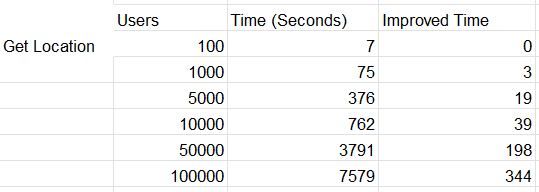
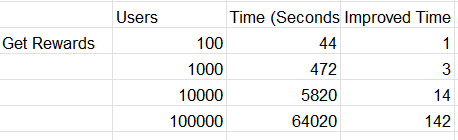

<h1 align="center">Welcome to TourGuide 👋</h1>

> TourGuide is a Spring Boot application and a component of the TripMaster application portfolio. It enables users to explore nearby tourist attractions and access discounts.

## Versions
- Spring Boot: 2.4.2
- Gradle 7.0.2
- JDK: 19
- JUnit Jupiter: 5.8.1
- Jacoco: 0.8.22
- MapStruct: 1.5.5.Final

## Run the app

To launch the TourGuide application, you can follow these steps:

1. Make sure you have the required versions of Java and dependencies installed.
2. Open a terminal or command prompt and navigate to the project directory.
3. Run the following command to build the project and create an executable JAR file:
` ./gradlew bootJar `
4. Once the build is successful, you can launch the app using the following command:
` java -jar build/libs/tourGuide.jar `
This will start the app on the configured server address : http://localhost:8080

## Testing

Run the command for testing:
- `$ ./gradlew test `

Run the command to generate the jacoco report:
- `$ ./gradlew jacocoTestReport `

## Endpoints
Note: use "?userName=internalUser1" as param for testing the endpoints

- /getLocation
- /getNearbyAttractions
- /getRewards
- /getAllCurrentLocations
- /getTripDeal
- /userPreferences

## Performance

